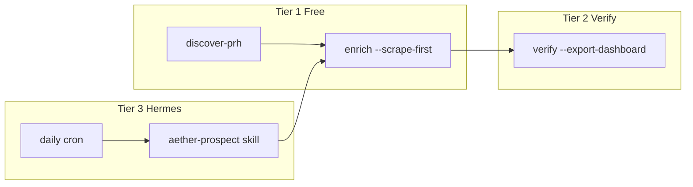

# Aether Applied — Prospect Pipeline Runbook

Limit-safe prospecting: **public-web discovery** for new ICP leads, then verify + dashboard export.

## Autonomous search (primary)

**Hermes orchestrates.** Default path is free Google-style search — not Codex, not Gemini.

> `/prospect-search find 100 Finnish companies in energy, manufacturing, mining and proptech...`

```bash
cd ai-agents/google-ai-prospect-agent && source .venv/bin/activate

python cli.py hermes-search \
  --country Finland \
  --industries "energy,manufacturing,mining,proptech" \
  --revenue "10M - 5B EUR" \
  --limit 100 \
  --verify \
  --update-call-list
```

Hermes skill [`hermes-skill/SKILL.md`](hermes-skill/SKILL.md) maps NL → `hermes-search`. Gemini only with `--provider gemini`. Notion sync is opt-in (`--sync-notion`).

**Triggers:** `/prospect-search`, `/aether-prospect`

### Fallback (PRH + scrape, no Google search)

```bash
python cli.py discover-prh --aether --limit 20
python cli.py enrich -i output/latest.csv --scrape-first --max-llm-calls 0 --preserve-companies
python cli.py verify -i output/latest.csv --export-dashboard
```

## Strategy tiers

| Tier | Tool | Cost | When |
|------|------|------|------|
| 1 | `discover-prh` + `enrich --scrape-first --max-llm-calls 0` | **Free** | Daily default |
| 2 | `verify --export-dashboard` | Free | After enrichment |
| 3 | Hermes `/aether-prospect` + cron | Automates free batch runs | After Hermes install |
| 4 | Manual public-web research | Free | For one-off named companies |



## Daily command (free — no API limits)

```bash
cd ai-agents/google-ai-prospect-agent
source .venv/bin/activate

python cli.py enrich \
  -i output/latest.csv \
  --limit 25 \
  --scrape-first \
  --contacts-per-company 2 \
  --preserve-companies \
  --output-dir output

python cli.py verify -i output/latest.csv --export-dashboard
```

- **0 LLM calls** — scrapes contact pages for phones
- **25 companies/day** → full 200 in ~8 days
- `output/latest.csv` updates after each enrich run

## Free company discovery (no seed CSV)

```bash
python cli.py discover-prh --aether --limit 200
```

Uses PRH/YTJ open API. No API key. Writes `output/latest.csv`.

## ICP defaults (`--preset aether`)

| Filter | Value |
|--------|--------|
| Country | Finland |
| Revenue | €1M – €5B |
| Industry | Industrial automation, energy, machine shops, LVI, metals, process |
| Contact 1 | CTO, teknologiajohtaja, tutkimusjohtaja, Head of R&D, innovaatiojohtaja |
| Contact 2 | CEO, toimitusjohtaja, COO, VP Engineering |
| Companies | 200 |
| Contacts / company | 2 |
| Phones | Required (switchboard OK) |

Override in `aether_icp.py` or via CLI flags.

## Hermes orchestration (tier 3)

Install Hermes:

```bash
curl -fsSL https://hermes-agent.nousresearch.com/install.sh | bash
```

Install skill:

```bash
hermes skills install "$(pwd)/hermes-skill"
# or: ln -sf "$(pwd)/hermes-skill" ~/.hermes/skills/aether-prospect
```

Daily cron (weekdays 08:00):

```bash
hermes cron add "0 8 * * 1-5" "/aether-prospect enrich daily batch"
```

See [`hermes-skill/SKILL.md`](hermes-skill/SKILL.md) for full procedure.

## After verify — dashboard import

```bash
cd ../../outreach-automation/aether-applied-leads/backend
python -m scripts.import_google_prospects ../data/google_ai_prospects_verified.csv
```

Or upload at **leads.teodor.fi → Uploads** with source `google-ai-prospect`.

## API keys (`.env`)

No API keys are required for the free workflow.

### Gemini grounded search (`--provider gemini`)

| Variable | Default | Notes |
|----------|---------|-------|
| `GAP_GEMINI_API_KEY` | — | Required for Gemini mode |
| `GAP_GEMINI_MODEL` | `gemini-2.5-flash` | GA model ID; default for reliable structured JSON and contact quality ($0.30 / 1M input tokens) |
| `GAP_PROVIDER` | `google` | Use `openrouter` only if routing via OpenRouter |

**Model note (Jul 2026):** Default is `gemini-2.5-flash` after Flash-Lite 503s and weaker JSON/contact quality. Use `gemini-2.5-flash-lite` only for cost-sensitive runs (~3× cheaper input).

## Key files

| File | Purpose |
|------|---------|
| `output/call_list.csv` | **Primary dial sheet** — cumulative outreach-ready leads (deduped) |
| `output/latest.csv` | Rolling enriched list (Hermes + daily workflow input) |
| `output/web_prospects_20260707_115644.csv` | Original 200-company seed |
| `data/google_ai_prospects_verified.csv` | Dashboard export target |
